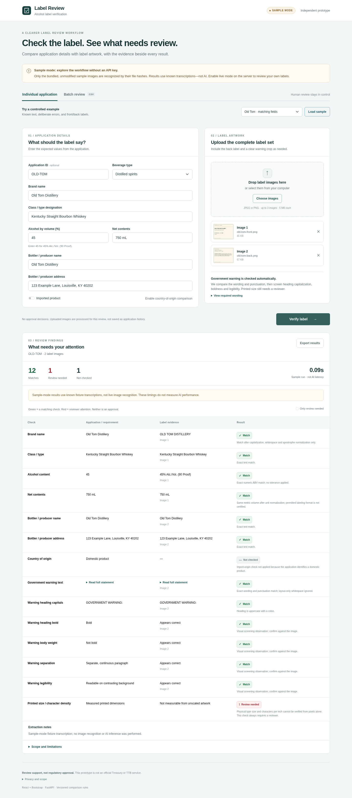

# AI-Powered Alcohol Label Verifier

A standalone prototype that compares alcohol label information with application data and flags discrepancies for human review. The project includes a live AI extraction adapter and deterministic Python validation, displaying the expected value, observed text, explanation, and source-image references for each check.

**The hosted demo uses sample mode.** It demonstrates the individual and batch review workflows with bundled labels and predefined extraction results. Live AI extraction is implemented in the source code but is not enabled on this deployment.

This is a review assistant, not an automated regulatory approval system.

## Application access

**Hosted sample demo:** https://ai-alcohol-label-verifier-6qc1.onrender.com
**Source code:** [GitHub repository](https://github.com/abeni8/ai-alcohol-label-verifier)

The sample demo runs in the browser without a local installation, OpenAI API key, API credits, or review access code. The interface displays **SAMPLE MODE**.

> **Demo limitation:** Sample mode performs no OCR or AI image recognition. It accepts only the unchanged bundled sample images, identified by their content hashes, and uses predefined text and visual-formatting observations. Unfamiliar or modified images are rejected. The comparison rules still run against the application values entered in the form or CSV; results are not evidence of live AI accuracy or speed.

| Processing mode | Behavior | Availability |
| --- | --- | --- |
| **SAMPLE MODE** (`PROVIDER=demo`) | Loads predefined extraction results for the unchanged bundled images; runs the comparison and warning-validation rules without AI API calls. | Hosted demo and default local configuration |
| **LIVE AI** (`PROVIDER=openai`) | Sends uploaded JPEG/PNG images to the configured AI provider for extraction, then runs the same comparison rules. Requires server-side credentials and available API usage. | Implemented in the source; not enabled on the hosted demo |

## Features

The hosted demo exercises these features using sample evidence. Text extraction and visual-formatting observations come from fixtures in sample mode, not from analysis of the uploaded pixels.

- **Individual review:** manual entry of application values with up to three front, back, or detail label images.
- **Field comparisons:** brand, class/type, alcohol content, net contents, producer name/address, and country of origin for imports.
- **Warning checks:** wording, punctuation, heading capitalization, and provisional visual findings for boldness, paragraph separation, and legibility. A text difference view highlights warning discrepancies.
- **Clear results:** green **Match**, red **Review needed**, and gray **Not checked**, with explanations rather than color alone. Normalized matches are explicitly identified.
- **Batch review:** CSV-to-image mapping, up to 300 application rows, two concurrent application requests, progress tracking, cancellation, retry of unfinished rows, and CSV export.



## Using the sample demo

### Individual review

Select a sample scenario and choose **Load sample** to populate the form and attach the corresponding label images. Select **Verify label**, then inspect the expected values, sample observations, explanations, and source-image references.

The bundled distilled-spirits example uses **OLD TOM DISTILLERY**, **Kentucky Straight Bourbon Whiskey**, **45% ABV**, and **750 mL**, together with producer information. Other sample scenarios include an ABV mismatch, warning punctuation error, title-case heading, incomplete image evidence, and an imported product.

The application values remain editable. For example, change the expected ABV from **45** to **40** while retaining the original 45% sample label, then verify again to inspect the mismatch. This tests the comparison logic, not image recognition.

Manual image selection also works with the original files in [samples/](samples/). Resized, cropped, edited, or unrelated images are not recognized by the sample adapter and will be rejected.

The upload interface accepts one to three JPEG or PNG images, up to **5 MiB and 24 megapixels each**. PDF, HEIC, GIF, animated PNG, and ZIP uploads are not supported. Printed type size always requires manual review, so even a label with matching text can have a red finding.

### Batch review

Open **Batch review** and select **Load sample batch**, then **Validate CSV & image mapping**, followed by **Start batch**. Processing begins only after validation and an explicit start. Inspect individual findings and use the CSV export to review the combined results.

Custom CSVs can also be tested by downloading the CSV template and selecting the referenced images. **In sample mode, every image must still be an unchanged bundled sample file.** A custom CSV does not enable analysis of new labels.

Each CSV row represents one application and names its associated images. Results appear as individual applications finish. The browser tab must remain open; batch state does not survive a refresh. See [CSV format and examples](docs/CSV_FORMAT.md).

## Approach

**Extraction and comparison are separate.** The extraction adapter supplies structured observations; deterministic Python functions compare those observations with the application values. Sample mode substitutes predefined observations for AI extraction while exercising the same validation and results workflow.

1. **Validate inputs.** FastAPI accepts application data and images. Pydantic validates the data, while Pillow checks image limits and prepares images for processing.
2. **Obtain observations.** In sample mode, the adapter identifies unchanged bundled images by their content hashes and loads predefined fields, uncertainty flags, visual-formatting observations, and source-image numbers. In optional live mode, one OpenAI Responses API request per application produces those observations. Expected application values are not sent to the extraction model, which is instructed to transcribe visible text rather than reconstruct missing text or follow instructions embedded in images.
3. **Compare deterministically.** Python functions compare the observations with the application and run the warning-specific checks. Missing, ambiguous, or unsupported evidence is not accepted as a match.
4. **Present findings.** React displays comparison rows, a warning-text diff, image references, and timing information. Results support a human decision rather than issuing an approval or rejection.

FastAPI keeps the backend focused on validation and API requests without adding a database, administrative interface, or account system. The frontend and API can be served together as a single service. No model training, vector database, autonomous agents, or orchestration framework is used.

## Tools used

| Tool | Role |
| --- | --- |
| Python 3.13, FastAPI, Uvicorn | Backend API, request handling, and application server |
| React, Bootstrap | Forms, image previews, comparison tables, and responsive styling |
| Vite | Frontend development server and build tooling |
| Bundled sample images and fixtures | Known label inputs and predefined extraction results for sample mode |
| OpenAI Responses API | Optional live image extraction; the default model is `gpt-4.1-mini`, configurable through the environment. Not called in sample mode. |
| Pydantic, pydantic-settings | Input and extraction-schema validation; environment configuration |
| HTTPX | Asynchronous server-side requests to the AI provider in live mode |
| Pillow | Image decoding, orientation correction, and preparation; not OCR |
| pytest, Node test runner, Playwright | Backend, frontend logic, and browser workflow tests |
| GitHub Actions, Render configuration, Docker | CI and deployment configuration |

## Comparison rules

These rules operate on fixture observations in sample mode and model observations in live mode.

| Check | Implemented behavior |
| --- | --- |
| Brand, class/type, producer, and origin | Normalize capitalization, whitespace, Unicode composition, and equivalent apostrophes. No fuzzy matching or inferred synonym/address equivalence. |
| Alcohol content | Compare an explicitly printed percentage numerically: `45` and `45.0` match. No percentage tolerance; proof alone is not converted into a missing ABV. |
| Net contents | Compare metric volume in mL, cL, or L: `0.75 L` and `750 mL` match. This does not certify the printed format or standards of fill. |
| Warning text | Compare wording, case, and punctuation against the configured reference after whitespace-only normalization. Body-case differences are conservative screening flags, not legal determinations. |
| Warning presentation | Check the case-sensitive `GOVERNMENT WARNING:` prefix and evaluate the provided observations for bold heading, non-bold body, paragraph separation, and legibility. Visual observations are predefined in sample mode and provisional model findings in live mode. |
| Printed type size | Always **Review needed** because the images do not supply a reliable physical scale. |
| Optional comparisons | Display **Not checked** when an optional expected ABV is omitted or domestic origin is not requested. This is not an exemption decision. |

## Assumptions and limitations

**Demo scope.** The hosted demo accepts only the unchanged bundled sample images and uses predefined extraction results. It demonstrates forms, comparison rules, warning findings, batch processing, and error handling. It does not demonstrate recognition of new images, live AI accuracy, or live model latency.

**Application scope.** Application values are entered manually or supplied in a CSV; application-form PDFs and COLA integration are outside scope. The form covers distilled spirits, wine, and malt beverages. The form requires country of origin for imported products. Expected ABV is required for distilled spirits and optional for wine/malt-beverage comparisons. The warning workflow is scoped to beverage alcohol at or above 0.5% ABV; a supplied lower value is flagged for review.

**Evidence.** Missing text means it was not found in the supplied images according to the observations, not necessarily that it is absent from the container. In live mode, glare, blur, small text, and angled photographs can prevent reliable extraction; valid structured output does not guarantee an accurate transcription. Visual formatting findings require judgment and do not establish physical type size. Sample-mode uncertainty and formatting findings are predefined test observations, not fresh visual assessments.

**Regulatory coverage.** The prototype does not determine all category-specific exceptions, class/type legality, appellation rules, standards of fill, character density, or claim substantiation. A matching field is not a finding of complete regulatory compliance.

**Performance.** About five seconds per application is a design target, not a demonstrated guarantee. Browser and server timings are exposed, and the evaluation script records latency and failures. The default 12-second provider timeout in live mode is a failure limit, not evidence of meeting the target. Sample-mode results do not measure live AI accuracy or latency; a 300-row queue test does not establish 300-application live throughput.

**State and access.** There is no database, saved application history, durable background queue, or user-account system. The sample demo uses no review access code. An optional shared access code can be configured for other deployments; batch state and any entered access code remain in the active tab. In live mode, canceling a browser request cannot guarantee cancellation of an upstream model request already in progress.

**Network and data.** Sample mode makes no AI provider requests and requires no OpenAI credentials or credits. The browser still sends application data and selected images to the application backend. In live mode, the backend needs outbound HTTPS to the AI provider and transmits images to that provider, whose retention policies also apply. Frontend assets are bundled, and no persistent application/image store is implemented. Use synthetic or otherwise shareable labels. This prototype is not a production security authorization.

Additional design details are in [Approach and assumptions](docs/APPROACH.md) and [Security](docs/SECURITY.md).

## Local setup and run instructions

Use **Python 3.13**. The included frontend build means Node is not required to run the application locally.

```bash
git clone https://github.com/abeni8/ai-alcohol-label-verifier.git label-review
cd label-review
python3.13 -m venv .venv
source .venv/bin/activate
python -m pip install -r requirements.txt
[ -f .env ] || cp .env.example .env
```

For an existing checkout, start from its root directory and skip the clone command. Use the explicit Python version when creating the virtual environment; an older system interpreter can cause runtime errors. The conditional copy preserves an existing `.env` file.

Set these existing values in `.env` for the sample configuration, leaving other settings unchanged:

```dotenv
PROVIDER=demo
OPENAI_API_KEY=
REVIEW_ACCESS_TOKEN=
```

Then start the server:

```bash
python scripts/run.py
```

Open **http://127.0.0.1:8000** and confirm **SAMPLE MODE**. Select **Load sample**, then **Verify label**. No API key, API credits, or review access code is needed for this configuration. Restart the server after changing `.env`.

On Windows, use `py -3.13 -m venv .venv` and `.venv\Scripts\Activate.ps1`. Create the configuration with `Copy-Item .env.example .env` only if `.env` does not already exist; the remaining Python commands are unchanged.

### Optional live AI configuration

Live extraction is implemented but is not enabled on the hosted sample demo. To run a separate live configuration, set the following in the local `.env` file or hosting environment, then restart the server:

```dotenv
PROVIDER=openai
OPENAI_API_KEY=your-server-side-key
OPENAI_MODEL=gpt-4.1-mini
REVIEW_ACCESS_TOKEN=your-separate-review-access-code
```

`REVIEW_ACCESS_TOKEN` is optional. When configured, its value is entered in the application's access-code field. It is separate from the OpenAI key. Never commit `.env` or credentials, and never enter the OpenAI key into the frontend.

The interface displays **LIVE AI** when that provider is selected. Live mode requires valid server-side credentials and available API usage; requests may incur provider charges. Missing credentials, unavailable services, timeouts, and invalid responses produce explicit errors. Live mode never falls back to sample answers. Remaining settings and defaults are documented in [.env.example](.env.example).

### Frontend development

Use **Node 22.12+**. With FastAPI running in a separate terminal:

```bash
cd frontend
npm install
npm run dev
```

Vite proxies `/api` requests to port 8000. After frontend changes, run `npm run build` in `frontend/`; the single-service application serves the generated `frontend/dist` directory.

The included frontend was built from the JSX source using the repository's offline build path and bundled React/Bootstrap assets. The standard Vite path and its validation status are documented in [the test report](docs/TEST_REPORT.md).

## Testing and evaluation

From the repository root, with the virtual environment active:

```bash
python -m pip install -r requirements-dev.txt
python -m pytest -q
node --test frontend/tests/*.test.mjs
```

With the server running in sample mode:

```bash
python scripts/evaluate.py --allow-demo --output reports/sample-smoke.json
```

This exercises the application using known sample observations. It does not measure image-recognition accuracy or live model latency.

Browser workflow tests also require Chromium:

```bash
python -m playwright install chromium
python scripts/browser_review.py
```

For optional live evaluation, run a server with `PROVIDER=openai` and valid API credentials. If access protection is enabled, set `REVIEW_ACCESS_TOKEN` in the evaluator's shell, then run:

```bash
python scripts/evaluate.py --runs 3 --output reports/live-evaluation.json
```

The evaluator rejects sample mode unless `--allow-demo` is explicit. Reports include successful-request median/p95 latency, request failures, and selected false matches on controlled examples. A deployed endpoint can be selected with the script's `--url` option.

The checked-in [test report](docs/TEST_REPORT.md) records backend, frontend, browser, and controlled-sample results, including mocked provider calls and the browser bridge used in the development environment. Those results do not establish live-image accuracy or five-second performance.

## Deployment

FastAPI serves both the API and the compiled frontend as a single web service. The sample configuration uses the same application code with a different extraction provider.

| Setting | Sample-mode service |
| --- | --- |
| Runtime | Python 3.13 |
| Build command | `pip install -r requirements.txt` |
| Start command | `python scripts/run.py --host 0.0.0.0` (reads the hosting platform's `PORT`) |
| Readiness endpoint | `/api/ready` |
| `PROVIDER` | `demo` |
| `OPENAI_API_KEY` | Unset or empty; not used in sample mode |
| `REVIEW_ACCESS_TOKEN` | Unset or empty for the sample demo |

Hosted environment settings are separate from a local `.env` file. Configuration changes require restarting or redeploying the service to take effect.

The included `render.yaml` describes a separate **live-AI, paid-compute** Blueprint configuration, not the sample-mode settings above. The repository also includes a Docker alternative. Additional deployment details and live-mode troubleshooting are in [DEPLOYMENT.md](docs/DEPLOYMENT.md).

`/api/ready` checks configuration presence; in live mode it does not validate provider quota, credentials, or successful inference. A successful sample-mode request validates the demo workflow, not live image extraction.

## Repository structure

```text
backend/app/       API routes, schemas, image handling, extraction, and validation
backend/tests/     Backend and mocked-provider tests
frontend/src/      React forms, results, batch queue, exports, and styling
frontend/dist/     Included frontend build
frontend/tests/    Frontend logic tests
samples/           Synthetic labels, CSV examples, and sample-mode fixtures
scripts/           Run, build, browser-test, and evaluation utilities
docs/              Approach, CSV format, security, testing, and deployment notes
evidence/          Recorded test outputs and sample-mode screenshots
```

## References and licensing

Warning-reference sources used by the implementation: [TTB health warning guidance](https://www.ttb.gov/regulated-commodities/beverage-alcohol/distilled-spirits/ds-labeling-home/ds-health-warning) and [27 CFR Part 16](https://www.ecfr.gov/current/title-27/chapter-I/subchapter-A/part-16). Further technical references are listed in [APPROACH.md](docs/APPROACH.md).

See [LICENSE](LICENSE) and [THIRD_PARTY_NOTICES.md](THIRD_PARTY_NOTICES.md).
